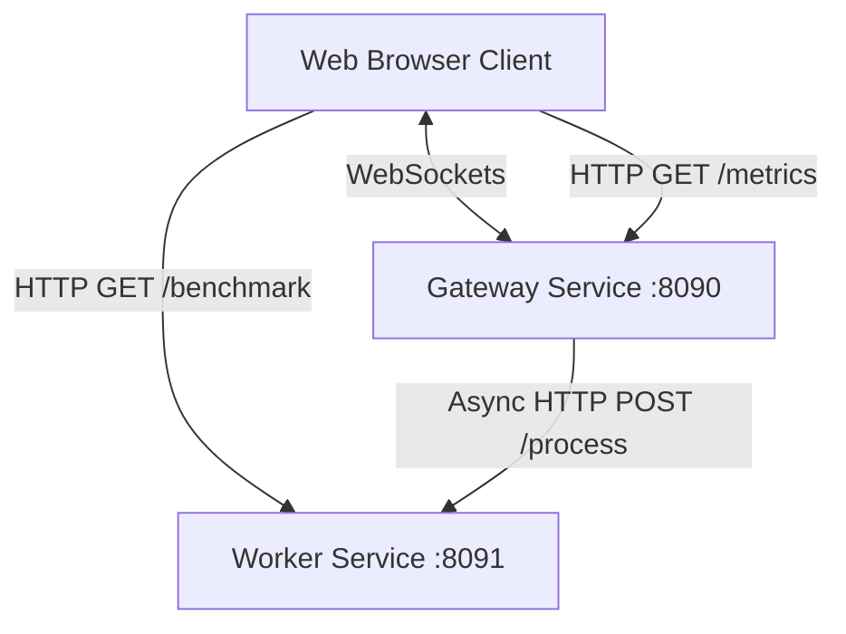

# Distributed Live Chat System

A high-performance, concurrent, and distributed live chat application designed to demonstrate advanced systems engineering patterns, including backpressure, asynchronous pipelines, network failure tolerance, and CPU-bound benchmark processing.

---

## 🏗️ Architecture Overview

The system consists of three decoupled components:
1. **Frontend Client (Port 8000 / Port 80 in Docker):** A modern, responsive dark-mode Web interface utilizing native WebSockets for real-time interaction and HTTP fetch for system metrics/benchmarks.
2. **Gateway Service (Port 8090):** A Spring Boot web application managing incoming client WebSocket connections, keeping track of active sessions, queuing incoming tasks, enforcing backpressure, and dispatching processing requests asynchronously to the Worker service.
3. **Worker Service (Port 8091):** A Spring Boot REST service acting as the computation backend, processing messages (e.g., sentiment analysis simulations) and performing high-load CPU benchmarks comparing sequential vs. parallel stream pipelines.



---

## 🛠️ Key Architectural Patterns & Concurrency Design (Project A)

* **Distributed Network Boundary:** The Gateway communicates with the Worker via Java 21's modern `HttpClient` synchronous REST calls isolated inside per-channel executors.
* **Bounded Resources & Input Backpressure:** The Gateway limits concurrency via an explicit processing `ThreadPoolExecutor` (Core: 10, Max: 50, Queue: 100). If the queue is saturated, it invokes `AbortPolicy` which drops the incoming message immediately, increasing the `droppedRequests` metric to protect the system from resource exhaustion.
* **Per-Channel Message Ordering:** Spawns a dedicated single-threaded executor for each channel (e.g. `#general`, `#random`, `#support`). Messages on a channel are processed sequentially, ensuring strict FIFO ordering within that channel without needing one global lock.
* **Slow-Client Backpressure:** Wrapped WebSocket sessions in a custom `BoundedSession` containing a bounded queue (`ArrayBlockingQueue` of capacity 50). Outbound messages are sent asynchronously via a dedicated `senderExecutor`. If a client is slow and its queue overflows, messages are dropped for that client (`droppedBySlowClient` telemetry is incremented), ensuring slow clients do not block fast clients or exhaust heap memory.
* **Network Boundary Timeout & Recovery:** Gateway-to-Worker communication enforces a strict **3-second** request timeout.
* **Graceful Degradation (Fallback):** If the Worker times out or goes offline, the Gateway catches the exception and broadcasts a system alert fallback message to the channel instead of failing or crashing.
* **Graceful Shutdown:** Initiates orderly termination via `@PreDestroy` when shutting down, allowing running jobs across all executors to complete within 5 seconds before forcing termination.
* **CPU-Bound Benchmark:** Endpoint to compare sequential and parallel computation speeds over 5,000,000 random floating-point operations.

---

## 📊 Concurrency Scorecard

| Question | Mechanism Used | Evidence |
| :--- | :--- | :--- |
| **Thread-safe?** | Thread-safe collections (`ConcurrentHashMap`), atomic primitives (`AtomicLong`, `AtomicBoolean`), and single-threaded channel workers. | Zero locks are used for message routing. Active WebSocket sessions are stored in a `ConcurrentHashMap` inside [ChatWebSocketHandler.java](file:///c:/Users/User/OneDrive/Desktop/4th%20year/Semester%208/Concurrent%20Programming/distributed-concurrent-chat/gateway-service/src/main/java/com/chat/gateway/websocket/ChatWebSocketHandler.java). |
| **Visibility guaranteed?** | Java `volatile` reads/writes under atomic primitives, thread-safe queues (`LinkedBlockingQueue`, `ArrayBlockingQueue`), and safe publication patterns. | Thread state handoffs occur via Java concurrency libraries ensuring a happens-before memory visibility boundary between thread pools. |
| **Deadlock-free?** | Thread pools run fully independently, avoiding any nested locks or cyclic synchronization waits. | No locks are acquired during HTTP calls or message broadcasting. Workers run sequentially without locking. |
| **Liveness guaranteed?** | Tasks do not block each other across channels; slow clients do not block fast clients. | Dedicated single-threaded executors are spawned dynamically per channel. Messages on `#random` flow instantly even if `#general` is locked/blocking. |
| **Bounded resources?** | Bounded thread pools, bounded worker queues, and client-specific outbound message queues. | Input gateway pool is sized Core 10 / Max 50 with a queue limit of 100. Each `BoundedSession` socket queue is limited to 50 items. |
| **Failure recovery path?** | Custom 3-second HTTP timeouts and connection failure exceptions catch blocks returning system broadcast alerts. | Handled via [GatewayService.java](file:///c:/Users/User/OneDrive/Desktop/4th%20year/Semester%208/Concurrent%20Programming/distributed-concurrent-chat/gateway-service/src/main/java/com/chat/gateway/service/GatewayService.java) request timeouts, which route a fallback alert message to clients without crashing the worker threads. |

---

## ⚙️ Executor Sizing & Thread Pool Rationale

### 1. Gateway Processing Pool (`executor`)
* **Type:** `ThreadPoolExecutor`
* **Configuration:** Core size: `10`, Max size: `50`, Bounded Queue: `LinkedBlockingQueue(100)`
* **Sizing Rationale:** Since the gateway's primary job is receiving JSON frames, submitting task routing, and handling HTTP network dispatching, tasks are highly I/O bound. Sizing the core to `10` allows handling initial traffic bursts instantly, while letting it scale to `50` concurrent execution threads under heavy concurrent load. A bounded queue size of `100` prevents heap saturation.

### 2. Slow-Client Sender Pool (`senderExecutor`)
* **Type:** `ThreadPoolExecutor`
* **Configuration:** Core size: `10`, Max size: `30`, Bounded Queue: `LinkedBlockingQueue(500)`
* **Sizing Rationale:** This pool manages outbound `session.sendMessage` writes. Since client sockets are I/O bound and potentially slow, this pool is isolated from the main message processing pool. If a client goes offline or lags, its outbound writes can temporarily block one of these threads. The caller-runs policy ensures that if the pool is saturated, the scheduling thread helps push writes, enforcing native backpressure up the stack.

### 3. Channel Processing Workers (`channelExecutors`)
* **Type:** Striped Single-Threaded Executors (`Executors.newSingleThreadExecutor`)
* **Configuration:** 1 thread per active chat channel (e.g. `#general`, `#random`, `#support`)
* **Sizing Rationale:** The core Project A requirement states that per-channel message ordering must be strictly preserved without using a global lock. By mapping each channel to its own single-threaded worker executor, messages sent to that channel are processed in absolute FIFO order. Because different channels use distinct threads, there is no cross-channel blocking.

---

## 🚀 Running the Project

### Method 1: Using Docker Compose (Recommended)

Make sure you have [Docker](https://www.docker.com/) and [Docker Compose](https://docs.docker.com/compose/) installed.

1. **Spin Up All Services:**
   Run the following command in the root folder of the project:
   ```bash
   docker compose up --build
   ```
   *This builds the Gateway and Worker jars inside multi-stage Docker build containers (no local Java or Gradle installation required on the host), sets up the frontend Nginx web server, and boots all three containers.*

2. **Access the Application:**
   Open your browser and navigate to:
   * **Frontend Application:** [http://localhost:8000](http://localhost:8000)
   * **Gateway Metrics Endpoint:** [http://localhost:8090/metrics](http://localhost:8090/metrics)
   * **Worker Benchmark Endpoint:** [http://localhost:8091/benchmark](http://localhost:8091/benchmark)

3. **Shut Down Services:**
   To stop the containers and clean up the network:
   ```bash
   docker compose down
   ```

---

### Method 2: Running Locally (Without Docker)

Ensure you have **Java 21 (or later)** installed.

> [!NOTE]
> Since Gradle wrapper files (`gradlew`/`gradlew.bat`) are not included in the repository, you will need either **Gradle** installed globally on your machine, or a modern IDE (such as IntelliJ IDEA or VS Code) to run the application classes directly.

#### 1. Start the Worker Service (Backend Engine)
* **Option A: Via IDE (IntelliJ IDEA / VS Code)**
  Open the `worker-service` directory in your IDE. Allow the IDE to import the Gradle project, then run the main class:
  ```bash
  src/main/java/com/chat/worker/WorkerApplication.java
  ```
* **Option B: Via Terminal (If Gradle is installed globally)**
  Navigate to the `worker-service` folder and run:
  ```bash
  gradle bootRun
  ```
* *Runs on port:* ``` 8091```

#### 2. Start the Gateway Service (WebSocket API)
* **Option A: Via IDE (IntelliJ IDEA / VS Code)**
  Open the `gateway-service` directory in your IDE. Allow the IDE to import the Gradle project, then run the main class:
  ```bash
  src/main/java/com/chat/gateway/GatewayApplication.java
  ```
* **Option B: Via Terminal (If Gradle is installed globally)**
  Navigate to the `gateway-service` folder and run:
  ```bash
  gradle bootRun
  ```
* *Runs on port:* ```8090```

#### 3. Serve the Frontend
* Navigate to the `frontend` folder.
* Start a simple web server:
  ```bash
  python -m http.server 8000
  ```
* Open [http://localhost:8000](http://localhost:8000) in multiple browser tabs.

---

## 🧪 Interactive Presentation Guide & Failure Injection

To demonstrate the concurrency features and resiliency during a live demo or presentation:

### 1. Triggering Timeout & Graceful Fallback
1. Open the Chat Web UI ([http://localhost:8000](http://localhost:8000)).
2. Type a message containing the word **`sleep`** (e.g. `"Testing sleep mode"`).
3. **What happens:** The Worker is programmed to sleep for 4 seconds upon receiving `sleep`. Because the Gateway's timeout is set to 3 seconds, the Gateway will abort the task and send a red **`[System Alert] Worker service offline or busy`** fallback message back to all active client screens.

### 2. Simulating Worker Service Outage (Resiliency)
1. Stop the worker container:
   ```bash
   docker compose stop worker-service
   ```
2. Try sending any message from the Chat UI.
3. **What happens:** The Gateway catches the network connection failure instantly and responds with the fallback alert message. The system remains fully responsive and does not crash.
4. Restart the worker:
   ```bash
   docker compose start worker-service
   ```
5. Send another message. The Gateway automatically restores healthy communication with the Worker and messages are processed successfully again.

### 3. Measuring System Metrics
Click the **"Check Gateway Metrics"** button in the UI or fetch [http://localhost:8090/metrics](http://localhost:8090/metrics) to read:
* Active WebSocket connection count
* Total requests processed
* Dropped requests by Backpressure
* Failed/timed-out requests
* Average processing latency in milliseconds

### 4. Running CPU Stream Benchmark
Click the **"Run Worker CPU Benchmark"** button in the UI or fetch [http://localhost:8091/benchmark](http://localhost:8091/benchmark).
It triggers parallel vs. sequential computation stream calculations on the worker over 5,000,000 items and returns execution timing comparisons.
